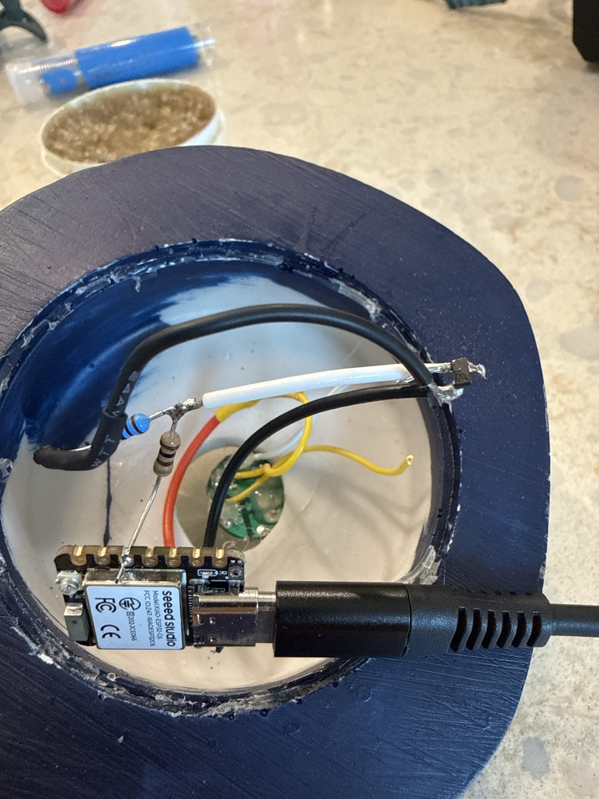
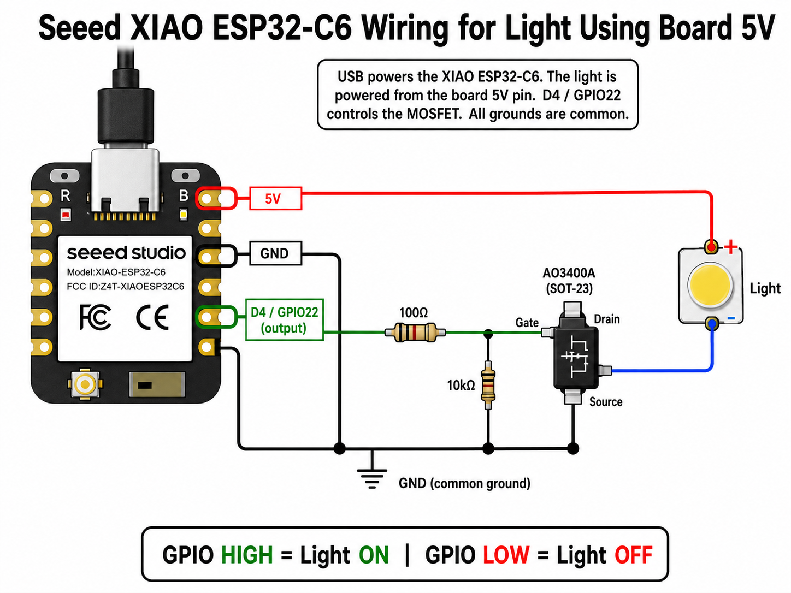

# Rays Stadium

A smart, Wi-Fi-enabled controller for a hacked **Tropicana Field "Light Up the Dome"** giveaway souvenir that automatically reacts to real Tampa Bay Rays MLB games.

The device runs on a Seeed Studio XIAO ESP32-C6 and drives the original 4V light using an AO3400A MOSFET. It turns the light on after Rays wins, flashes it for home runs and final wins, and turns it off before first pitch.

## In Action


## The Hack

This project started with the official **Rays "Light Up the Dome"** promo item given away at Tropicana Field.  
The original light was powered by **three 1.5V AA batteries (4.5V nominal, ~4V under load)** and had a simple push-button inside a battery compartment.

We removed the entire battery compartment and replaced it with:

- A **Seeed Studio XIAO ESP32-C6**
- An **AO3400A** N-channel MOSFET (low-side switch)
- A couple of resistors
- Some careful wiring

**Here's the completed build inside the dome:**



The result is a fully automatic, network-connected version of the dome light that knows when the Rays win (or hit a homer) and lights up accordingly.

## Wiring

The circuit uses low-side switching with the AO3400A MOSFET.

**Schematic diagram:**



| Connection                        | Details                                      |
|-----------------------------------|----------------------------------------------|
| **5V** → Light +                  | Power for the original 4V dome light         |
| Light – → **AO3400A Drain**       | Switched negative side of the light          |
| **AO3400A Source** → XIAO GND     | Common ground                                |
| **D4 / GPIO22** → 100Ω → **Gate** | Gate drive resistor                          |
| **Gate** → 10kΩ → **Source/GND**  | Gate pull-down resistor                      |

**Important notes:**
- Do **not** connect the light directly to a GPIO pin, the MOSFET handles the current.
- The 100Ω resistor limits inrush/gate current.
- The 10kΩ resistor ensures the MOSFET stays off when the pin is floating or during boot.
- The XIAO ESP32-C6's onboard LED (pin 15) is also used for status during setup.

### Inside the Dome: Choosing Which Wire to Control

The original Rays "Light Up the Dome" giveaway had a three-position switch inside the battery compartment that selected between:

- Cycling RGB colors
- Off
- Static amber

Both the cycling RGB and static amber modes are powered through **yellow wires**. You must identify and use the correct yellow wire for the mode you want. The **white wire** is ground/negative.

We tapped the yellow wire for the cycling RGB lights. This gives the light a lively multi-color cycling effect whenever the controller turns it on (visible in the stadium.GIF above).

**If you prefer only the static amber:**

- Use a small separate power source (such as a 3×AA battery holder or a bench supply set to ~4V) to safely test and identify which yellow wire controls the cycling RGB vs. the static amber (and confirm the white wire is the negative).
- Once you've confirmed the correct yellow wire for your desired mode, carefully snip the other yellow wire (plus any unused wires). This permanently selects only the mode you want.

Work slowly and test with limited current before making any permanent cuts. Double-check polarity, we are switching the negative side through the MOSFET (Light – connects to the AO3400A Drain).

## Features

- **Automatic game reaction** (Tampa Bay Rays, team ID 139)
  - Light turns on after a Rays win
  - Brief celebratory flash on home runs
  - Longer flash on final win
  - Light is forced off 1 hour before first pitch
- **Local web interface** served directly from the device
  - Shows the most recent Rays game result
  - Manual on/off control with optional timed override
  - Works even if internet is down (once Wi-Fi is configured)
- **Easy first-time setup**
  - Creates a captive portal AP called `Rays-Stadium-Setup` if no Wi-Fi credentials are stored
- **Over-the-air (OTA) updates** (hostname: `rays-stadium`)
- **Robust**: Watchdog timer, automatic reconnect, exponential backoff on API failures
- **No cloud dependency** for day-to-day operation after initial setup

## Web Interface

Once connected to your network, the device is available at:

- `http://rays-stadium.local` (or `http://rays-stadium`)
- Or its IP address

The interface shows the latest Rays game and lets you manually control the stadium light.

## Getting Started

### Prerequisites

- Arduino IDE or Arduino CLI with ESP32 support
- Seeed Studio XIAO ESP32-C6 board package
- ArduinoJson library (install via Library Manager)

### Building the Embedded Web Assets (optional but recommended)

The web UI is minified and embedded at compile time:

```bash
npm install
npm run build:web
# or directly:
python3 scripts/build_web_assets.py
```

This updates `web_assets.h`.

### Flashing

1. Open `Rays_Stadium.ino`
2. Select the correct board (XIAO ESP32-C6)
3. Set your OTA password in the sketch if desired (line ~22)
4. Upload

On first boot with no stored Wi-Fi, the device will create the `Rays-Stadium-Setup` access point. Connect to it, open a browser, and configure your home Wi-Fi.

## Related

There's also a companion Python script (`rays_monitor.py`) that can control USB power on a Raspberry Pi using `uhubctl` for a different (USB-powered) version of the same idea.

## License

See [LICENSE](LICENSE) file.

---

Made with love for the Tampa Bay Rays and a little 4V dome light that deserved a second life.

Thank you for the support!

[](https://www.buymeacoffee.com/h89j2hhgs7t)